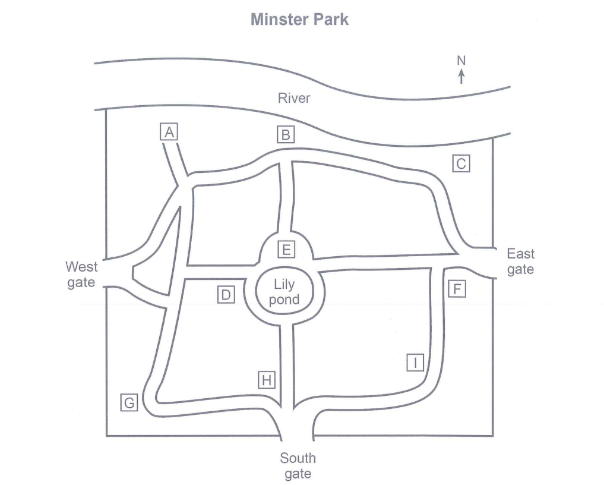

- WOMAN: 
I’m very pleased to welcome this evening’s guest speaker, Mark Logan, who’s going to tell us about the recent transformation of Minster Park. Over to you, Mark.

- MARK: 
Thank you. I’m sure you’re all familiar with Minster Park. It’s been a feature of the city for well over a century and has been the responsibility of the city council for most of that time. What perhaps isn’t so well known is the origin of the park: unlike many public parks that started in private ownership, as the garden of a large house, for instance, Minster was some waste land, which people living nearby started planting with flowers in 1892 (Q11). It was unclear who actually owned the land, and this wasn’t settled until 20 years later, when the council took possession of it.

You may have noticed the statue near one of the entrances. It’s of Diane Gosforth, who played a key role in the history of the park. Once the council had become the legal owner, it planned to sell the land for housing. Many local people wanted it to remain a place that everyone could go to, to enjoy the fresh air and natural environment – remember the park is in a densely populated residential area. Diane Gosforth was one of those people, and she organised petitions and demonstrations (Q12), which eventually made the council change its mind about the future of the land.

Soon after this the First World War broke out, in 1914, and most of the park was dug up and planted with vegetables (Q13), which were sold locally. At one stage the army considered taking it over for troop exercises and got as far as contacting the city council, then decided the park was too small to be of use. There were occasional public meetings during the war, in an area that had been retained as grass.

After the war, the park was turned back more or less to how it had been before 1914, and continued almost unchanged until recently. Plans for transforming it. were drawn up at various times, most recently in 2013, though they were revised in 2015, before any work had started. The changes finally got going in 2016 (Q14), and were finished on schedule last year.

OK, let me tell you about some of the changes that have been made – and some things that have been retained. If you look at this map, you’ll see the familiar outline of the park, with the river forming the northern boundary, and a gate in each of the other three walls. The statue of Diane Gosforth has been moved: it used to be close to the south gate, but it’s now immediately to the north of the lily pond, almost in the centre of the park (Q15), which makes it much more visible.

There’s a new area of wooden sculptures, which are on the river bank, where the path from the east gate makes a sharp bend (Q16).

There are two areas that are particularly intended for children. The playground has been enlarged and improved, and that’s between the river and the path that leads from the pond to the river (Q17).

Then there’s a new maze, a circular series of paths, separated by low hedges. That’s near the west gate -you go north from there towards the river and then turn left to reach it (Q18).
       
There have been tennis courts in the park for many years, and they’ve been doubled, from four to eight. They’re still in the south-west corner of the park, where there’s a right-angle bend in the path (Q19).

Something else I’d like to mention is the new fitness area. This is right next to the lily pond on the same side as the west gate (Q20).

Now, as you’re all gardeners, I’m sure you’ll like to hear about the plants that have been chosen for the park.
 